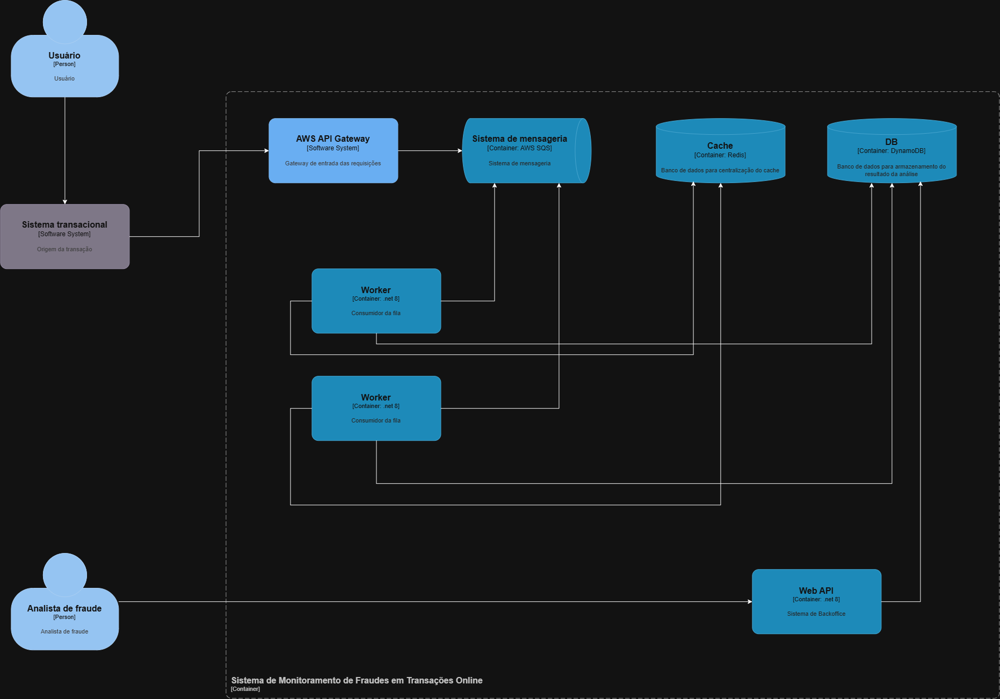

# Sistema de Monitoramento de Fraudes em Transações Online

## 1. Visão Geral
Este projeto apresenta a solução arquitetural e uma Prova de Conceito (PoC) executável para o sistema de detecção de fraudes em transações online do **Banco Itaú**, desenhado sob os requisitos de **alta vazão (10.000 TPS)**, **baixa latência (< 1s)**, **resiliência** e **manutenibilidade**.

A solução é construída sob a plataforma AWS utilizando a stack **.NET 8 (C#)**, orientada a eventos e desenhada sob os princípios da **Clean Architecture**, **SOLID** (com ênfase no Princípio Aberto-Fechado via *Strategy Pattern*) e **CQRS** (separação estrita entre o fluxo crítico de escrita e a interface de leitura do backoffice).

---

## 2. Diagrama de Arquitetura (C4 Model - Nível 2)


---

## 3. Decisões Arquiteturais e Trade-offs (ADRs)

### 3.1. Ingestão Direta (API Gateway Service Proxy)
Optou-se por **não utilizar** uma Web API na borda apenas para intermediar o tráfego HTTP para a fila.
* **Trade-off:** Remove-se o controle de código na borda em troca de altíssima escalabilidade delegada à nuvem.
* **Justificativa:** Em um cenário de pico extremo (10k TPS), containers na borda se tornam o principal gargalo (warm-up, HPA delay). Utilizando o **API Gateway integrado diretamente ao SQS**, ganhamos resiliência imediata, validação de payload nativa via JSON Schema (economizando custos) e autenticação mTLS sem onerar a computação.

### 3.2. Mensageria (SQS vs Kafka)
* **Trade-off:** Abre-se mão de retenção de longo prazo e *replay* massivo de eventos (nativos do Kafka) em prol de simplicidade operacional.
* **Justificativa:** Para o caso de uso (Work Queue), o Kafka seria um overengineering que traria alta complexidade operacional. O SQS (Standard ou FIFO High Throughput) suporta o volume exigido com gerenciamento zero (serverless) atuando como um *shock absorber* (Backpressure) perfeito para os workers.

### 3.3. Separação de Responsabilidades (CQRS)
* **Trade-off:** Aumenta ligeiramente a complexidade do projeto ao separar modelos de escrita e leitura.
* **Justificativa:** O padrão CQRS isola a API de Backoffice do Motor de Fraudes. As queries dos analistas (que podem ser analíticas e envolver múltiplos filtros) jamais competem por recursos computacionais ou locks de banco de dados com a ingestão crítica de 10k TPS.

### 3.4. Ciclo de Vida dos Serviços (Singleton vs Scoped)
* **Decisão:** Registros como **Singleton** para os repositórios, cache e mensageria.
* **Justificativa:** O consumidor opera em um `BackgroundService` contínuo. Registrar serviços stateless como `Singleton` evita *Captive Dependencies* e elimina a criação/destruição de dezenas de milhares de escopos por segundo, mitigando pausas de Garbage Collector (GC Gen 0) e garantindo latência na casa dos sub-milissegundos.

---

## 4. Regras de Detecção de Fraude e Critérios de Risco

As regras implementam o padrão **Strategy** (`IFraudRuleStrategy`) e utilizam **Auto-Discovery via Reflection (Assembly Scanning)** na inicialização (`AddApplicationServices`). 
Isso atende plenamente ao **Requisito 5** do desafio (*"Garantir que o sistema seja extensível para adicionar novas regras de detecção sem alterar a estrutura principal da aplicação"*): qualquer nova regra criada na pasta `Application/Rules` que implemente a interface é descoberta e injetada no container automaticamente, sem necessidade de alterar o `Program.cs`.

| Regra | Critério Técnico | Classificação de Risco | Justificativa |
| :--- | :--- | :--- | :--- |
| **Valor Atípico** (`HighValueRule`) | Valor $\ge$ R$ 10.000<br>Valor $\ge$ R$ 50.000 | **Médio** (`Medium`)<br>**Alto** (`High`) | Valores que fogem bruscamente do padrão transacional de canais digitais exigem validação preventiva imediata. |
| **Frequência Incomum** (`TransactionFrequencyRule`) | $\ge$ 3 transações em 60s<br>$\ge$ 5 transações em 60s | **Médio** (`Medium`)<br>**Alto** (`High`) | Rajadas de transações em curto intervalo caracterizam ataques de força bruta, testes de cartões clonados ou lavagem. |
| **Geolocalização Divergente** (`GeoVelocityRule`) | Deslocamento geodésico (Haversine) com velocidade aparente $> 800$ km/h | **Alto** (`High`) | **Viagem Impossível (Teletransporte):** Transações consecutivas em cidades ou países distantes em intervalo fisicamente incompatível indicam comprometimento de credenciais. |

### Matriz de Consolidação de Risco:
* **Baixo / Nenhum (`None`/`Low`)**: Transação aderente ao perfil habitual do cliente $\rightarrow$ **Aprovada** (`Approved`).
* **Médio (`Medium`)**: Alerta de atenção disparado $\rightarrow$ **Sinalizada** (`Flagged`) para revisão/validação de segundo fator.
* **Alto (`High`)**: Violação crítica $\rightarrow$ **Sinalizada** (`Flagged`/Bloqueio preventivo) com *short-circuit* imediato no pipeline para economia de milissegundos.

---

## 5. Estrutura do Projeto (Clean Architecture)

```text
FraudMonitor/
├── src/
│   ├── Domain/               # Entidades, Enums e Value Objects Ricos (Location com Haversine)
│   ├── Application/          # Regras (Strategy), Interfaces modularizadas (Provider, Queue, Repository, Strategy) e Orquestrador
│   ├── Infrastructure/       # Persistência NoSQL (DynamoDB), Cache (Redis) e Mensageria (SQS via Channels)
│   ├── Worker/               # Consumidor de eventos em segundo plano e Simulador de fluxo contínuo
│   └── BackofficeApi/        # API RESTful CQRS para consulta e filtros de analistas de fraude
└── test/
    └── FraudMonitor.Tests/   # 19 Testes unitários automatizados (xUnit + Moq)
```

---

## 6. Como Executar o Projeto

### Pré-requisitos
* [.NET 8 SDK](https://dotnet.microsoft.com/download/dotnet/8.0) (ou superior; o projeto já possui `RollForward` configurado para compatibilidade transparente com runtimes modernos).

### 6.1. Executar os Testes Unitários
Para rodar a suíte completa de testes automatizados (regras de negócio, orquestrador, filtros de consulta e persistência):
```bash
dotnet test
```

### 6.2. Executar o Worker (Processador & Simulador em Tempo Real)
O Worker inicia automaticamente o consumidor assíncrono e o simulador contínuo de eventos, persistindo os registros em tempo real no banco local compartilhado (SQLite em modo WAL de alta performance, simulando o DynamoDB):
```bash
dotnet run --project src/Worker/FraudMonitor.Worker.csproj
```

*Exemplo de saída no terminal (Serilog estruturado em inglês):*
```text
[17:36:35.439 INF] >>> SqsConsumerWorker started. Listening for incoming queue messages (SQS)...
[17:36:35.445 INF] >>> TransactionStreamSimulator started. Injecting real-time transactional stream...
[17:36:35.987 INF] [TRANSACTION_APPROVED] TransactionId: TXN-LEG-BF6C2BF1 | ClientId: CLI-557 | Amount: $322.04 | LatencyMs: 18.76 ms
[17:36:36.211 ERR] [FRAUD_ALERT_TRIGGERED] TransactionId: TXN-GEO2-6FEF92AE | ClientId: CLI-TELEPORT-11 | RiskLevel: High | Amount: $300.00 | TriggeredRules: DivergentGeolocation | Reasons: [DivergentGeolocation]: Teleportation detected: transaction performed 18.537 km away... | LatencyMs: 5.32 ms
[17:36:37.106 ERR] [FRAUD_ALERT_TRIGGERED] TransactionId: TXN-VAL-AAA047EF | ClientId: CLI-936 | RiskLevel: High | Amount: $73,204.00 | TriggeredRules: HighValueTransaction | Reasons: [HighValueTransaction]: Extremely atypical transaction amount... | LatencyMs: 1.05 ms
```

### 6.3. Executar a API de Backoffice
Em outro terminal, execute a API:
```bash
dotnet run --project src/BackofficeApi/FraudMonitor.BackofficeApi.csproj
```
Acesse a documentação interativa do **Swagger UI**:
* **URL:** `http://localhost:5000` (redireciona automaticamente para `/swagger`)

Como o Worker e a API compartilham o armazenamento (`SqliteTransactionStore` com WAL), **todos os alertas de fraude emitidos pelo Worker refletem instantaneamente no Swagger em tempo real**!

#### Autenticação JWT (Role-Based Access Control)
O endpoint de consulta é protegido com `[Authorize(Roles = "FraudAnalyst")]`. 
Para autenticar na PoC, utilize as credenciais padrão de analista:
* **Username:** `analyst`
* **Password:** `itau@2026`

*1. Obter Token JWT:*
```bash
curl -X POST "http://localhost:5000/api/auth/token" \
     -H "Content-Type: application/json" \
     -d '{"username":"analyst","password":"itau@2026"}'
```

*2. Consultar Alertas Protegidos com Bearer Token:*
```bash
TOKEN=$(curl -s -X POST "http://localhost:5000/api/auth/token" -H "Content-Type: application/json" -d '{"username":"analyst","password":"itau@2026"}' | grep -o '"accessToken":"[^"]*' | cut -d'"' -f4)

# Chamada autenticada com sucesso (HTTP 200) refletindo as transações do Worker
curl -X GET "http://localhost:5000/api/fraudalerts?riskLevel=High" \
     -H "Authorization: Bearer $TOKEN"

# Chamada sem token (Bloqueada - HTTP 401 Unauthorized)
curl -i -X GET "http://localhost:5000/api/fraudalerts"
```
*No Swagger UI:* Basta clicar no botão **Authorize 🔒**, inserir o token obtido no campo de valor e executar as consultas protegidas diretamente na interface visual.

---

## 7. Uso de Inteligência Artificial no Case

Em conformidade com as orientações do processo seletivo do Itaú (*"O uso de Inteligência artificial está liberado, deixe explícito como e em qual momento do case você usou"*):

* **Fase de Arquitetura e Concepção:** O desenho arquitetural C4 Nível 2 e as decisões de ADR (Ingestão Direta via API Gateway Service Proxy, SQS e CQRS) foram elaborados pelo candidato.
* **Fase de Codificação e Refinamento:** A Inteligência Artificial (Google Antigravity / Gemini) foi utilizada como **ferramenta de aceleração e pair programming**:
  1. Geração de código boilerplate e estruturação inicial de interfaces.
  2. Implementação e discussão técnica de fórmulas matemáticas de domínio (ex: fórmula de Haversine para o cálculo de distância geodésica em quilômetros).
  3. Criação de geradores de dados realistas e cenários de teste automatizados (xUnit + Moq) cobrindo limites de risco e casos extremos.
  4. Revisão e refatoração arquitetural para eliminação de classes utilitárias anêmicas (`Common`), migrando comportamentos para Value Objects ricos (`Location.DistanceToInKm`).

---

## 8. Evoluções Futuras para Ambiente Produtivo
* **Escalabilidade Proativa:** Adoção de **KEDA** (Kubernetes Event-driven Autoscaling) para escalar os pods do Worker com base na profundidade da fila do SQS antes da saturação de CPU/Memória.
* **Shadow Mode:** Execução de novas regras e modelos de Machine Learning (SageMaker) em modo passivo/sombra para medição prévia da taxa de falsos positivos antes do bloqueio real.
* **Persistência Analítica:** Indexação de transações sinalizadas no **OpenSearch** para análises textuais livres e geração de dashboards em tempo real por analistas de fraude.
